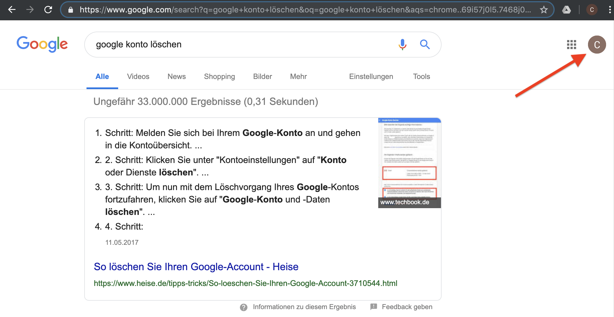

# Do it Yourself! *Von IoT bis Data Science in einem Rutsch*

**Bastelstrecke für wenig Geld und mit frei zugänglichen Ressourcen zur Demystifizierung gehypter Begriffe wie "Internet of Things" (IoT), "Cloud" und "Data Science"**

## Worum es geht

Hochtrabende Begriffe wie "Internet of Things", "Cloud" und "Data Science" klingen spannend, erscheinen dem Durchschnittsmenschen jedoch oft eher abstrakt und wenig anfassbar. Hier wollen wir das alles auch für Anfänger und mit günstigen Mitteln anfassbar machen! 

Dieses Repository ist eine Schritt-für-Schritt-Anleitung für Anfänger mit Neugierde und Spaß am Basteln. Wir verbinden als **IoT-Gerät** einen Kleinstcomputer (einen "Raspberry Pi") mit einem Wetter-Sensor. Die Daten, die damit generiert werden, werden in in die Google-**Cloud** geschoben und können dort visualisiert und auch mit maschinellem Lernen auf Unregelmäßigkeiten "**Data Science**"-mäßig hin analysiert werden.

Wer also mal eine komplette "End-to-End-Strecke" voller mystischer Themen bauen möchte, folge einfach dieser Anleitung in folgenden Schritten

1. [Was man braucht und woher man es bekommt!]
2. [Wie man seinen Raspberry Pi zusammensetzt und allgemein zum Laufen bringt!]
3. [Wie man den Sensor anbaut, die nötige Software auf den Raspberry bringt und das ganze mit Google verbindet!]
4. [Was man mit den Daten z.B. machen kann (und das Ganze in der Google-Cloud)!]

## Hinweise

- Dieses Projekt ist - *um es einfach zu halten* - **nicht vor dem Hintergrund von Sicherheitsaspekten optimiert. Es wird empfohlen, einen separaten Google Account zu nutzen, der nach dem Projekt ggf. gelöscht werden kann.**
- Dieses Projekt lehnt sich an den Blog-Eintrag von [whatimade.today](http://www.whatimade.today/log-sensor-data-straight-to-google-sheets-from-a-raspberry-pi-zero-all-the-python-code/) an, ist allerdings hinsichtlich der Ausführlichkeit der Anleitung und um einen Machine-Learning-Teil erweitert.

# Was man braucht und woher man es bekommt!

Bevor man loslegen kann, gibt's schon ein paar Werkzeuge, die gebraucht werden.  
Hier wird genau aufgelistet, was benötigt wird und woher man es z.B. bekommen kann.

## Grundvoraussetzungen

Um mit dem Raspberry Pi und der Google Cloud kommunizieren zu können, brauchen wir zunächst einfach nur 
- einen Computer inkl. 
- einer externen USB-Tastatur,
- einer USB-Maus und 
- eines Monitors mit HDMI-Ports 
- und einen Internetzugang über WLAN oder Ethernet 

Wir gehen mal davon aus, dass das vorhanden ist.

## Eine kleine Einkaufsliste

Die verwendete **Hardware** kostet insgesamt ca. 85 EUR:

- **Raspberry Pi** 3 Model B+ für ca. 35 EUR (erhältlich z.B. bei [Amazon](https://www.amazon.de/Raspberry-1373331-Pi-Modell-Mainboard/dp/B07BDR5PDW/ref=sr_1_5?s=computers&ie=UTF8&qid=1551864649&sr=1-5)).
- **Zubehör-Bundle für den Raspberry** für ca. 24 EUR inkl. Gehäuse mit Lüfter, SD-Karte, SD-Reader, Stromkabel mit Schalter etc. (erhältlich z.B. bei [Amazon](https://www.amazon.de/Raspberry-Smraza-Netzteil-Kühlkörper-Kompatibel/dp/B01L78AE5O/ref=sr_1_68?s=computers&ie=UTF8&qid=1551864540&sr=1-68))
- **Wetter-Sensor** (der im Prinzip auch ein wenig mehr kann) für ca. 19 EUR (erhätlich z.B. bei [Amazon](https://www.amazon.de/WINGONEER-Temperatur-Luftfeuchtigkeit-Sensormodul-Stützstapel/dp/B076SM2YG6/ref=sr_1_fkmr1_3?ie=UTF8&qid=1551865283&sr=8-3-fkmr1))
- **Kabel zum Anstecken des Sensors** für ca. 7 EUR (erhältlich z.B. bei [Amazon](https://www.amazon.de/Female-Female-Male-Female-Male-Male-Steckbrücken-Drahtbrücken-bunt/dp/B01EV70C78/ref=pd_bxgy_img_2/261-5391223-3170926?_encoding=UTF8&pd_rd_i=B01EV70C78&pd_rd_r=18f290c9-5164-11e9-a261-d16e70736dca&pd_rd_w=Xm96L&pd_rd_wg=nuRWs&pf_rd_p=449f5fd6-8f81-46b7-aa57-ca96572671a1&pf_rd_r=3BATMRXANMY73F7W9A30&psc=1&refRID=3BATMRXANMY73F7W9A30))

Es wäre prinzipiell auch möglich, den Preis eine ganze Ecke zu drücken. Man könnte eine abgespecktere Version des Raspberry zu verwenden, statt des vorgeschlagenen Zubehör-Bundles ein einfacheres zu nutzen oder bereits vorhandene Teile (z.B. SD-Karten und -Reader) zu verwenden und auch einen einfacheren und billigeren Sensor zu verwenden. Vermutlich käme man spartanisch auch mit etwa 40 EUR aus. Aber das haben wir nicht getestet und schlagen es deshalb auch hier nicht vor.

Die verwendete **Software** gibt's für umme:

- Software bzw. Scripte, die der Raspberry benötigt, um sich selbständig mit dem Netz zu verbinden, die Wetterdaten aus dem Sensor auszulesen und sie in die Cloud zu pushen, sind in diesem Repo abgelegt. Wie das genau funktioniert, darauf gehen wir in den nächsten Kapiteln ein.
- Alle sonstige "Software", die wir nutzen, sind Anwendungen von Google, die in der Cloud laufen und über das Internet erreichbar sind. Welche Anwendungen, das sind und wie wir sie nutzen, wird in den nächsten Kapiteln gezeigt. Alles geht mit einem einfachen **Google-Account**. Einen Google-Account gibt's umsonst (und vielleicht ist schon einer vorhanden). Da das Projekt allerdings nicht für Sicherheitsaspekte optimiert ist, ***empfehlen wir einen separaten Account anzulegen, der später ggf. auch gelöscht werden kann***. Dies zeigen wir im folgenden.

## Einen neuen Google Account erzeugen (und wie er gelöscht werden kann)

Wie zuvor beschrieben, ist das Projekt nicht für Sicherheitsaspekte optimiert. Wir empfehlen daher, einen separaten Google Account mit folgenden Schritten anzulegen, der später auch wieder gelöscht werden kann.

Ein Google Account kann direkt von der [Google-Startseite](https://www.google.com) aus **erstellt** werden:  

   

Von dort wird man durch den weiteren Prozess gut geführt (und ist danach automatisch eingeloggt und kann über den Browser auf sein Konto zugreifen).

Auch das **Löschen eines Accounts** geht einfach, indem man sich in sich in sein Konto einloggt...  

   

... und in den Kontoeinstellungen im Menüpunkt "Daten und Personalisierung" das Untermenü für "Dienst oder Konto löschen" wählt und dort den weiteren Anweisungen folgt:  

   

# Wie man seinen Raspberry Pi zusammensetzt und allgemein zum Laufen bringt!

## Zusammenschrauben des Raspberry Pi

**TO COME**

## Download und Installation des Betriebssystems des Raspberry Pi

Nach dem Zusammenschrauben kann der Raspberry (noch) nichts. Ihm fehlt das Betriebssystem, mit dem die verschiedenen Komponenten miteinander sprechen können. Da es je nach Anwendungszweck- und anforderungen verschiedene Betriebssysteme gibt, mit denen der Raspberry funktionieren kann, ist noch nichts vorinstalliert, sondern wir müssen das Betriebssystem unserer Wahl erst auf einer leeren/formatierten SD-Karte installieren (ist im gekauften Bundle ebenso wie ein SD-Kartenleser dabei).  

Das ganze Downloaden und Installieren braucht Zeit. **Insgesamt eine Stunde** sollte man dafür einplanen, man kann aber gut einen Kaffee dabei trinken ;-)

In der Regel - und auch hier - wird Raspbian, dass auf Linux basiert, genutzt. Man kann man von der [raspberrypi.org](https://www.raspberrypi.org/downloads/raspbian/)-Seite (https://www.raspberrypi.org/downloads/raspbian/) auf seinen Rechner herunterladen. Wir laden uns die Version **"Raspberry Strech with desktop and recommended software"** als zip-File herunter (knapp 2 GB, dauert also i.d.R. ein paar Minuten)  

   

und ent-zippen das Ganze (hat danach gut 5 GB).  

Das weitere Prozedere ist ebenfalls auf der [raspberrypi.org](https://www.raspberrypi.org/documentation/installation/installing-images/README.md)-Seite im Details beschrieben (https://www.raspberrypi.org/documentation/installation/installing-images/README.md ).  

Das Betriebssystem kann aber nicht einfach auf die SD-Karte kopiert werden; es muss ein "boot-fähiges Image gebrannt" werden. Wie auch in der Dokumentation beschrieben geht das einigermaßen komfortabel mit dem Programm [**"Etcher"**](https://www.balena.io/etcher/), das es für Windows, MacOS und Linux gibt (https://www.balena.io/etcher/, ca. 100 MB). 

Dann: 
- Leere/formatierte SD-Karte in den Kartenleser stecken, 
- mit dem Rechner verbinden, 
- Etcher starten und 
- "flashen" (was eine knappe halbe Stunde in Anspruch nehmen kann):  

   

Damit sich das Betriebssystem nun vollständig entpackt und initialisiert, stecken wir die **SD-Karte in den kleinen Slot an der Seite des Raspberry**, verbinden den Raspberry mit der USB-Tastatur und -Maus sowie dem HDMI-Bildschirm und schalten ihn dann ein - aber <u>erst dann!</u>, weil der Raspberry sonst z.B. den Bildschirm nicht erkennen kann.  

BILD WAS WO REINSTECKEN/VERBINDEN

**Erstes Booten und System-Update** des Raspberry (dauert wegen Entpacken des Systems und dem Download der Updates ca. 20min)
- So sieht des Startbildschirm aus:  
   
- Nun können/müssen die Landeseinstellungen angepasst werden:  
   
- Anschließend sollte das Passwort angepasst werden:  
   
- Außerdem brauchen wir eine WLAN-Verbindung (ggf. Passwort erforderlich!):  
   
- Zuletzt sollte man die Software zur Sicherheit auf den neuesten Stand bringen:  
   
- Zuletzt muss das System nochmals rebooten:  
   

**Fertig!** ... und bestimmt genug Kaffee für heute getrunken.

# Wie man den Sensor anbaut, die nötige Software auf den Raspberry bringt und das ganze mit Google verbindet!

## Setup für die Verbindung mit Google (und ab in die Wolke)

Zunächst bleiben wir mal auf dem Raspberry und loggen uns in unseren Account ein (s. 1.):

 
 
   

Nun basteln wir uns die **<u>Google Tabelle</u>, in die wir später die Daten pushen**.  
Wohlgemerkt liegen diese Tabelle und später die Daten in der Google-Cloud. D.h. wir können von überall und jederzeit darauf zugreifen.  

Erstmal suchen wir nach "Google Tabellen" (ist der kürzeste Weg...) und klicken den ersten Link:

   

Dann wechseln wir in die Cloud-Applikation ... 

   

... und übergehen mal die Tour ...

   

... sondern legen gleich mit einer neuen leeren Tabelle los:

   

Wir benennen die Tabelle passend mit "diy-iot2ds":

   

Bennen den Tabellenreiter mit "Daten":

 
   

Und bennen die Spalten A bis D in der Zeile 1 mit "Zeit", "Temperatur", "Luftdruck" und "Luftfeuchtigkeit":

 
   

Zuletzt merken wir uns für später, wo wir die **ID-Nummer der Tabelle** finden.  
Der Zugriff auf die Tabelle erfolgt nämlich im engeren Sinne nicht über den vermeintlichen Dateinamen, sondern über eine längliche innerhalb der Google-Cloud erzeugte ID, die sich aber einfach aus der http-Adresse ablesen lässt:

 
   

So, jetzt wird ein wenig sportlicher: wir erzeugen einen **<u>Schlüssel</u> mit dem wir später auf die Google-Tabelle automatisch/"von außen" zugreifen dürfen**. Dazu wechseln wir zu [GoogleAPIs](https://console.developers.google.com) und akzeptieren die entsprechenden Nutzungsbedingungen:

 
  
 
  

Dann suchen wir in der "Bibliothek" des "Google Sheets API" und aktivieren sie:

 
  
 
  
 
  

Anschließend erstellen wir das "Projekt", das diesen Zugriff nutzen soll. Natürlich soll es "diy-iot2ds" heißen:

 
  
 
  

Nun müssen wir das ganze "final" aktivieren:

 
  

Aber ohne Anmeldesdaten (sogenannte credentials geht natürlich und glücklicherweise nichts). 
Auf den nächsten Screens können wir sie uns besorgen und müssen sie anschließen spezifizieren:

 
  

- Verwendung der "Google Sheets API" 
- über "Andere Nicht-Benutzeroberfläche" 
- mit Zugriff auf die "Anwendungsdaten", 
- wobei wir keine App Engine oder Compute Engine verwenden ("Nein, ich verwende sie nicht")

 
  

Dann legen wir die eigentlichen die Anmeldedaten festlegen:

- "Name des Dienstkontos" gerne mal wieder als "diy-iot2ds" mit der
- "Rolle" "Bearbeiter" (aus dem Untermenü "Projekt") mit dem
- "Schlüsseltyp" "JSON"

 
  
 
  

Der erforderliche **"Schlüssel" (eine Datei im sog. "JSON"-Format) wurde erstellt und automatisch heruntergeladen und liegt im Ordner "Downloads" des Raspberry**.

 
  

Nun erlauben wir diesem "Nutzer" mit der Google Tabelle zu sprechen:

 
  

## Anschließen des Sensors

Damit der Raspberry mit den Steckplätzen sprechen kann müssen wir das zunächst in den Einstellungen aktivieren:

 
  
 
  

Dann schalten wir den Raspberry aus (und stecken ihn vom Netzteil ab), um den Sensor festzuklemmen (das Herunterfahren wird auch benötigt, um die veränderten Einstellungen zu aktivieren).

**TO COME**

Bevor wir den Sensor anschließen, sollte sichergestellt sein, dass der Raspberry nicht am Stromnetz hängt - ist besser für Mensch <u>und</u> Maschine...  
Der Sensor, den wir hier vorliegen haben, besteht eigentlich aus zwei Teilen. ...

## Download und Konfiguration der Software

Um die Software herunterzuladen "clonen" wir einfach dieses Github-Repository auf den Desktop des Raspberry. Dazu machen wir zunächst einen Terminal auf und geben `cd Desktop` für den Wechsel ins Desktop-Verzeichnis ein:

 
  

Dann geben wir `git clone https://github.com/birds-on-mars/diy-iot2ds` ein, wodurch der gesamte Inhalt dieses Repos in einen Ordner auf dem Desktop des Raspberry kopiert wird:

 
  
 
  

Weiterhin werden wir ein paar Bibliotheken brauchen, damit das heruntergeladene Programm mit der Google-Cloud sprechen kann. Dazu geben wir 

- `sudo apt-get update`
- `sudo apt-get install -y python-smbus i2c-tools`
- `pip install --upgrade google-api-python-client oauth2client httplib2`

in ein Terminalfenster ein.

 
  

Aus dem Ordner "Downloads" verschieben wir nun den vorhin kreierten "Schlüssel" in das Unterverzeichnis "src" des "diy-iot2ds"-Ordners auf dem Desktop:

 
  

Durch Doppelklick auf "push_data_to_google_sheet.py" (auch im Ordner "Desktop/diy-iot2ds/src") öffnet sich das entsprechende Python-Script in der auf dem Raspberry installierten "Thonny"-Programmierumgebung

 
   

Zwei Dinge sind hier (jeweils hinter dem `=`-Zeichen zu ergänzen:

- Der Name des "Schlüssel"-/"Credential"-Files (soetwas in der Art "diy-iot2ds-....json")
- Die ID der Google Tabelle (s. oben, dort wo wir die Tabelle vorbereitet haben) (die längliche Zahlen und Buchstabenreihe)

 
  

Nun speichern wir das modifizierte Skript (Button "Save").

Wir müssen auch überprüfen, ob die "pins"  wie erwartet sind (Adressen der Steckverbindungen des Sensors mit dem Raspberry).

Dazu geben wir im Terminal `i2cdetect -y 1` ein:

 
   

Sollte da `77` zu sehen sein, ist alles schon fein. Sollte da was anderes zu sehen sein (z.B. `76`), so doppelklicken wir nun auf "bme280.py" und ändern diese Nummer und speichern die Datei dann (alles wie gerade "push_data_to_google_sheet.py"):

 
   

Nun gucken wir, ob das Skript läuft, indem wir im Termninal mit `cd Desktop/diy-iot2ds/src` in unser Skript-Verzeichnis gehen und dort `python push_data_to_google_sheet.py` eingeben:

 
  

Hat's funktioniert? Zeigt sowohl der Terminal, als auch die Google-Tabelle die Daten an?  
**Es hat geklappt!!**

Wir wollen nun erreichen, dass der Raspberry - einfach beim Anschalten und ohne Befehlseingabe und ohne dass Tastatur, Maus und Bildschirm angeschlossen sein müssen - startet und dauerhaft alle paar Sekunden ausführt. Dazu müssen wir noch einen sogenannten "cronjob" einrichten. Im Terminal geben wir dafür `crontab -e` ein und geben dort in eine neue Zeile `@reboot (cd /home/pi/Desktop/diy-iot2ds/src ; python stream_weather_data.py)`:

 
  
 
  

*Sollten wir gefragt werden, welcher Editor es zum Erstellen des cronjobs es sein soll, nehmen wir einfach "nano" (Option 2 - auch Vorschlag des Systems).*

Und speichen und schließen mit `Strg-O` (oder `control-O`), `Enter` und `Strg-X` (oder `control-X`).

# Was man mit den Daten z.B. machen kann (und das Ganze in der Google-Cloud)!

## Erster Blick auf die Daten

## Erste Visualisierung in Google Sheets

## Daten-Analyse mit Google Colab